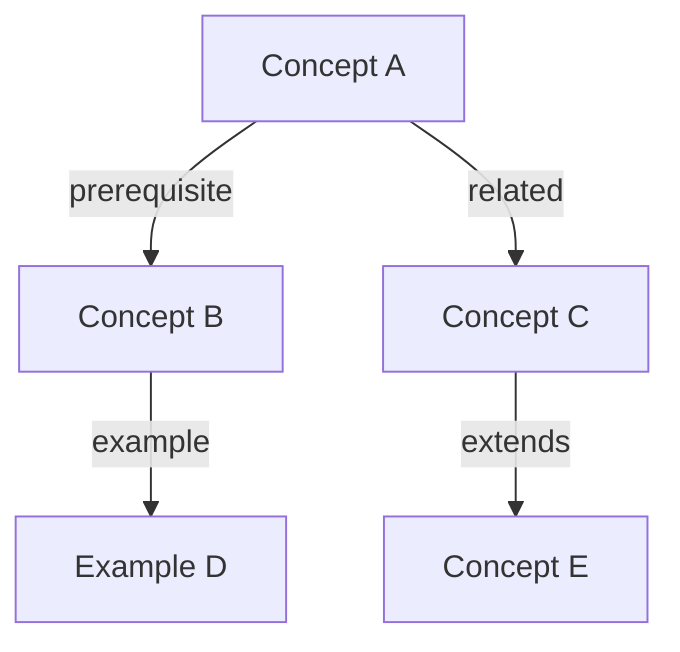

# Learn Connect

Build and strengthen your knowledge graph by discovering connections between notes.

## What it does

1. Scans vault notes for semantic similarities
2. Suggests missing `[[wikilinks]]` between related concepts
3. Generates "connection insight" notes explaining relationships
4. Creates visual knowledge maps (Mermaid diagrams)

## Connection Discovery Process

1. **Scan**: Read all notes in `Knowledge/` folder
2. **Analyze**: For each note, extract key concepts and topics
3. **Compare**: Find semantic overlap with other notes
4. **Suggest**: Propose new `[[wikilinks]]` with explanation
5. **Map**: Generate Mermaid diagram of the knowledge graph

## Usage

```
"Find connections in my notes"
"How does [topic-A] relate to [topic-B]?"
"Map my knowledge about [subject]"
"What gaps are in my understanding of [topic]?"
"Show me my knowledge graph"
```

## Connection Types

- **Prerequisite**: A must be understood before B
- **Related**: A and B share concepts but neither depends on the other
- **Contradiction**: A and B present conflicting information
- **Example**: A is a concrete instance of principle B
- **Extension**: A builds on or extends B

## Knowledge Map Output

Generate a Mermaid diagram saved as `Knowledge/Maps/[topic]-map.md`:

```markdown
# Knowledge Map: [Topic]



## Connections discovered:
- [[Concept A]] is prerequisite for [[Concept B]]: [explanation]
- [[Concept A]] relates to [[Concept C]]: [explanation]
```

## Gap Analysis

When asked about gaps, identify:
- Topics referenced in notes but without their own note (orphan links)
- Clusters of notes with no connections to other clusters
- Prerequisites that are mentioned but never explained
- Areas where the user has many facts but few principles

Output as `Knowledge/Maps/gaps-[date].md`

## Updating Existing Notes

When suggesting connections, offer to:
1. Add `[[wikilinks]]` to existing notes' "Connections" section
2. Create new "bridge" notes that explain the relationship
3. Update tags for better organization
